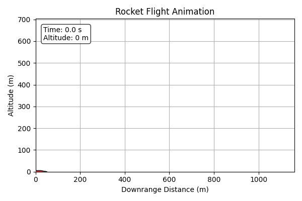
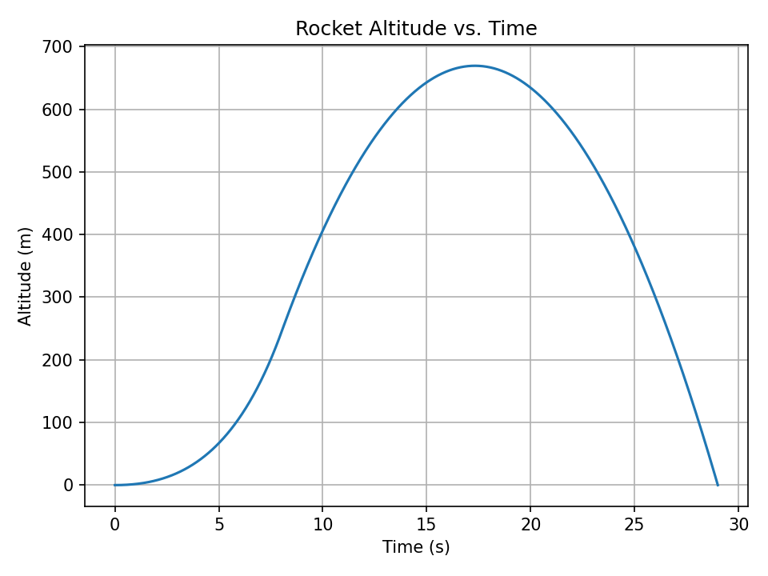
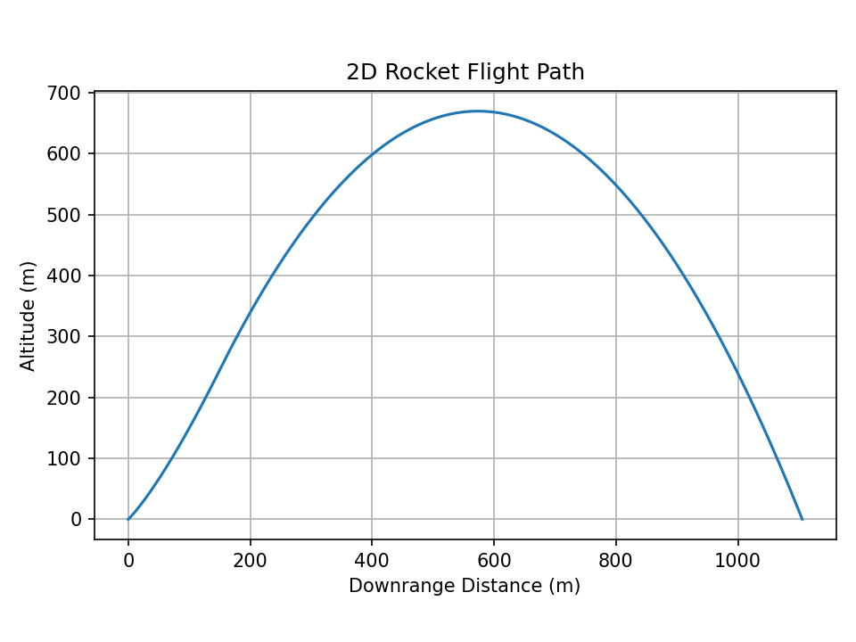

# Rocket Trajectory Simulator

Status: in development

A 2D rocket trajectory simulator written in Python. This project will model
rocket motion through the atmosphere and provide tools for exploring how launch
conditions, gravity, and aerodynamic drag affect flight performance.

## Features

Planned features include:

- RK4 trajectory integration for stable numerical simulation
- Drag and gravity modeling for more realistic 2D flight dynamics
- Altitude and velocity plots for analyzing rocket performance over time

## Example Output

The simulation shows a rocket reaching roughly 670 m apogee over a ~28 second flight.
